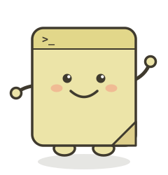
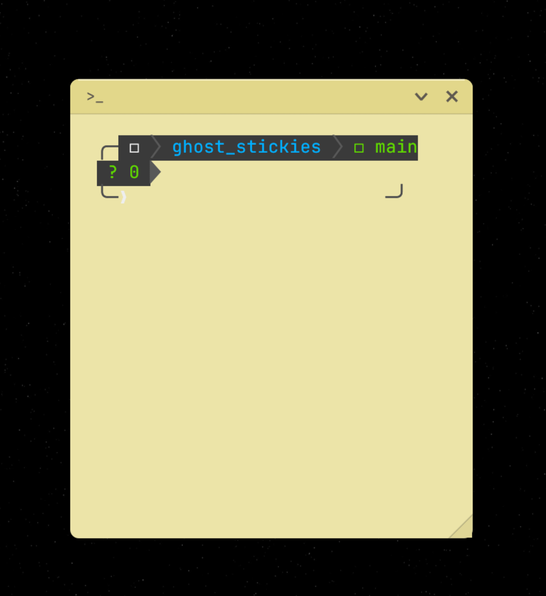

<div align="center">



# Sticky Terminal

**A tiny always-on-top terminal that looks like a paper sticky note.**

Stick a real shell anywhere on your screen. It's small, it's cute, it stays on top,
and it's a fun little Rust project you can crack open and make your own.



</div>

---

## What it is

Sticky Terminal is one window — a single paper sticky note holding one real
terminal. No tabs, no panels, no clutter. Drag it into a corner, run your
commands, peel it off when you're done.

It's also a **template**. The whole app is ~1,400 lines of readable Rust. If
you've ever wanted to build your own terminal app, fork this and go.

## Features

- 🗒️ **Looks like paper** — soft shadow, header band, folded dog-ear corner
- 🎨 **7 pastel papers** — Lemon, Peach, Rose, Mint, Sky, Lilac, Sand. Shuffle anytime
- 📌 **Always on top** — borderless, tiny, sticks above every other window
- 🤏 **Minimise** — collapse the note down to just its header bar
- 🫥 **Hide when screen sharing** — keep the sticky out of recordings (macOS)
- 🖱️ **Drag files in** — drop a file or folder to paste its path
- 🖼️ **Paste images** — `Cmd+V` an image and it pastes the saved file path
- 🔗 **Cmd+click URLs** to open them
- ⚡ Real PTY shell, scrollback, login shell on macOS so your `PATH` just works

## Quick start

You need [Rust](https://rustup.rs) installed. Then:

```bash
git clone https://github.com/rachel-nocode/sticky-terminal.git
cd sticky-terminal
cargo run
```

That's it. The sticky note pops up — drag it wherever you like.

## Build a real app (macOS)

To get a proper `StickyTerminal.app` you can keep in your Applications folder:

```bash
./scripts/build-macos-app.sh
```

It builds `dist/StickyTerminal.app`. Drag it into `/Applications` and you're set.

Want a shareable installer? `./scripts/build-dmg.sh` makes a drag-to-Applications
DMG. If you have an Apple Developer account, `./scripts/sign-and-notarize.sh`
signs and notarizes everything (see the script headers for setup).

## Keyboard shortcuts

| Shortcut | Action |
|----------|--------|
| `Cmd+Shift+T` | Shuffle to a random paper colour |
| `Cmd+Shift+P` | Toggle hide-when-screen-sharing |
| `Cmd+V` | Paste text, or paste an image as a file path |
| `Cmd+click` | Open a URL in the terminal |

The **▾ menu** in the header has shuffle colour, hide-when-sharing, and minimise.
Drag the **header** to move the note. Drag the **dog-ear corner** to resize.

## Make it your own

This repo is meant to be hacked on. See **[CUSTOMIZE.md](CUSTOMIZE.md)** for the
easy tweak points — paper colours, fonts, window size, keybinds — with exact
file and line pointers.

## Project layout

```
src/
  main.rs            window setup + app entry
  config.rs          load/save the chosen paper colour
  theme.rs           the terminal colour palette struct
  sticky.rs          the paper-sticky chrome + dropdown menu  ← start here
  ui/
    mod.rs           app state, the update loop, menu wiring
    pane.rs          the terminal grid: cells, cursor, scrollback
  terminal/
    mod.rs           the PTY shell + vt100 parser
    clipboard.rs     image-paste handling
```

## Vibe coder challenge

Fork it and add something:

- A live clock in the header band
- A "pin to this corner" snap
- More paper colours (or a custom-colour picker)
- A sound when a command finishes
- Sticky notes that remember their position on screen

If you build something fun, share it — tag the repo.

## Built with

[Rust](https://www.rust-lang.org) · [`eframe`/`egui`](https://github.com/emilk/egui)
· [`portable-pty`](https://crates.io/crates/portable-pty) ·
[`vt100`](https://crates.io/crates/vt100)

## Platform support

| | macOS | Linux / Windows |
|---|---|---|
| Run + build | ✅ | ✅ (via `cargo run`) |
| Hide-when-sharing | ✅ | — (macOS only) |
| `.app` / `.dmg` scripts | ✅ | — |

## License

MIT — see [LICENSE](LICENSE). Take it, fork it, make it yours.
Bundled fonts are under the SIL Open Font License (`assets/fonts/`).
